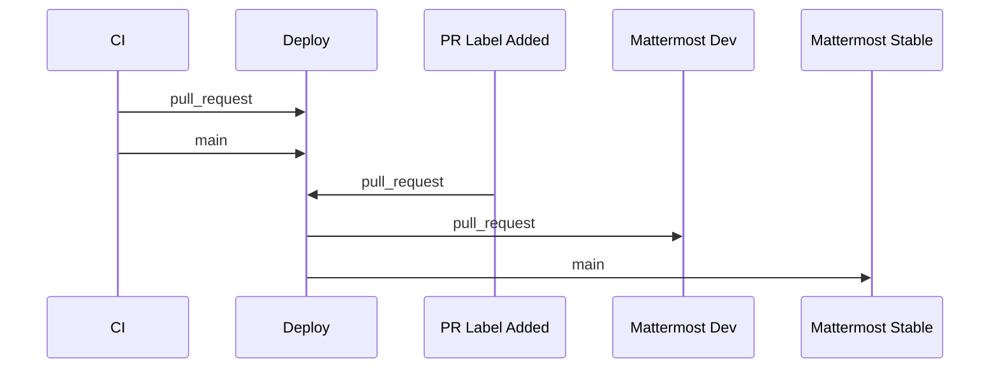

# Pipelines

Zowe Chat uses Github Actions as the automation platform to drive all of its pipeline needs. Zowe Chat has the following core pipelines defined:

* [Continuous Integration](#continuous-integration)
* [Sonar Scans]()
* [Demo System Deployment](#demo-system-deployment)
* [Publish]()

As well as the following secondary pipelines:

* [PR Label Trigger](#pr-label-trigger)
* [OpenSSF Scorecards]()

Some pipelines we may add in the future are:

* [Extended Tets/System Tests]()
* [CodeQL]()

## Continuous Integration

The continuous integration pipeline definition can be found [here](../.github/workflows/ci.yml). This pipeline builds Zowe Chat and runs both the unit and integration suites. A build matrix is defined for Node v16/v18 and Ubuntu-Linux. Future expansion of the matrix is possible, however, we expect the core runtime platform to be one of the supported LTS versions of Node and any common Linux distro. In the future we'll better control runtime by way of containerization and deployment artifacts (Kube/Helm), and the matrix may be instead reduced while the container build fans-out a platform matrix.

If the CI build is triggered on the main branch, it will trigger a deployment to a demo environment. If the CI Build is triggered within a PR and certain labels are set on the PR, it will deploy the code to another demo environment. See [here for more information](#demo-system-deployment).

For more information on the build, see [our gulpfile](../gulpfile.js).
For more information on the tests we run, see [testing](./testing.md).

## Sonar Scans

To be filled out -

## Demo System Deployment

The demo system deployment is responsible for deploying live versions of Zowe Chat to a demo mattermost cloud instance, and is setup to deploy both in-flight code via pull request labels and stable code in the main branch. Valid labels on pull requests are `chat-dev-1-deploy` and `chat-dev-2-deploy`, which deploy to bots `zowe-chat-dev-1` and `zowe-chat-dev-2`. The bot names and descriptions will be updated to reflect the code currently deployed, i.e. the bots are messaged by a form like `@zowe-chat-dev-1`, but the bot name will show as `Z Chat Dev PR-001` with a description showing the hash: `Commit abcdef`.

This deployment uses the workflow defined in [deploy-test-env.yml](../.github/workflows/deploy-test-env.yml). This workflow uses the custom actions defined in the [actions folder](../.github/actions/) to drive deployment and configuration of the Mattermost bot. The deployment target is currently a bare metal Linux instance, and in the future should instead use containers deployed in Kubernetes.

This workflow is invoked via workflow_dispatch, using Zowe's shared action workflows as the driving script. The call pattern is below:

## Publish

To be filled out later

### PR Label Trigger

This build exists to capture label-added events to pull requests and invoke the demo system deployment script, so we don't have to worry about adding empty commits to trigger pull_request sync on the ci build. This workflow is defined [here](../.github/workflows/pr-label-trigger-deploy.yml).

### OpenSSF Scorecards

See [the openssf documentation](https://securityscorecards.dev/#learn-more) for more information on what openssf scorecards are, and what they report on. There is currently no requirement to pass OpenSSF checks to merge in PRs, though it is still recommended to address any issue scored <7. The workflow is defined [here](../.github/workflows/scorecard.yml).
